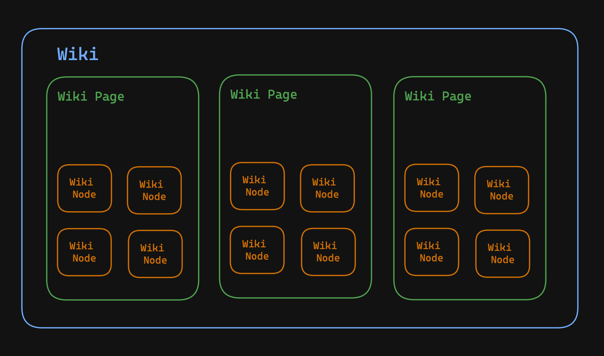

# RAG-Query 
A query engine for retrieval augmented generation and semantic search. Uses openai `text-embedding-3-small` to generate embeddings on text. 

## Current Features
* Sentence extractor with customizable abbreviation detection. 
* Text windows with variable sentence overlap to improve query granularity
* Upload `wiki_pages` and `wiki_nodes` to a mongodb database. 
    * Recommend setting up proper search indexes (see mongo docs)
* Retrieve relevant information based on user queries. 
## Working...
* Filter by `wiki_title` or `tags` 
* Query enrichment using generative ai (allows the system to add relevant details to the query to widen search results)

## About
### How Data is Modeled

1. Wiki - a collection of wiki_pages 
    * The wiki is the top level of your RAG-Query information store
    * Can invite other users to view and edit the wiki
2. Wiki Page - a collection of wiki_nodes
3. Wiki Node - the smallest information unit, contains a chunk of text from a wiki_page, and its text vector. 

## API 
### Auth
#### Sign In With Email and Password
> POST /api/auth/signin

#### Sign Up 
> POST /api/auth/signup

#### Forgot Password
> POST /api/auth/forgot-password

#### Reset Password
> POST /api/auth/reset-password/:resetToken

#### Update Profile
> POST /api/auth/update-profile

### Wikis

#### Create a new Wiki
> POST /api/wikis/create

#### Create a wiki page
> POST /api/wikis/:wikiId/page?id=\<pageid>

#### Query A Wiki 
> POST /api/wikis/:wikiId/search

